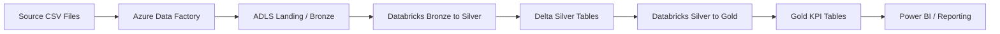

# Azure Databricks ADF Lakehouse Pipeline

Enterprise-style Azure lakehouse project that shows how to orchestrate ingestion with Azure Data Factory, transform data with Databricks, and publish curated Delta tables for reporting.

## Business Scenario
A UK retail business receives daily order extracts from multiple channels and needs a governed lakehouse that supports finance, commercial analytics, and country-level performance reporting.

## Tech Stack
- Azure Data Factory
- Azure Databricks
- Delta Lake
- Azure Data Lake Storage Gen2
- PySpark
- SQL

## Architecture


## Pipeline Flow
1. Azure Data Factory copies raw orders, customers, and products to ADLS landing storage.
2. ADF triggers Databricks notebooks with batch parameters.
3. Bronze ingestion preserves raw structure and timestamps every record.
4. Silver logic standardizes schema, filters bad records, deduplicates orders, and enriches with customer and product attributes.
5. Gold models publish country, category, and daily revenue metrics for business reporting.

## Repository Layout
```text
adf/pipeline-definition.json
databricks/notebooks/01_bronze_to_silver.py
databricks/notebooks/02_silver_to_gold.py
sample-data/orders.csv
sample-data/customers.csv
sample-data/products.csv
```

## Sample KPI Output
| order_date | country | total_revenue | total_orders | active_customers |
| --- | --- | ---: | ---: | ---: |
| 2026-04-18 | UK | 349.00 | 2 | 2 |
| 2026-04-19 | UK | 498.00 | 2 | 2 |
| 2026-04-19 | DE | 289.50 | 1 | 1 |

## Recruiter Talking Points
- Demonstrates medallion architecture in Azure
- Uses parameterized orchestration between ADF and Databricks
- Shows Delta Lake partitioning and business metric generation
- Mirrors common enterprise migration and reporting use cases

## How To Demo
1. Upload the sample CSV files into the landing container.
2. Create bronze, silver, and gold storage paths in ADLS.
3. Import the ADF pipeline JSON and attach linked services.
4. Run `01_bronze_to_silver.py` to build clean enriched silver data.
5. Run `02_silver_to_gold.py` to generate reporting-ready gold tables.

## Future Enhancements
- Add schema validation and quarantine handling for bad records
- Add Delta merge logic for incremental loads
- Add deployment through Azure DevOps or GitHub Actions
